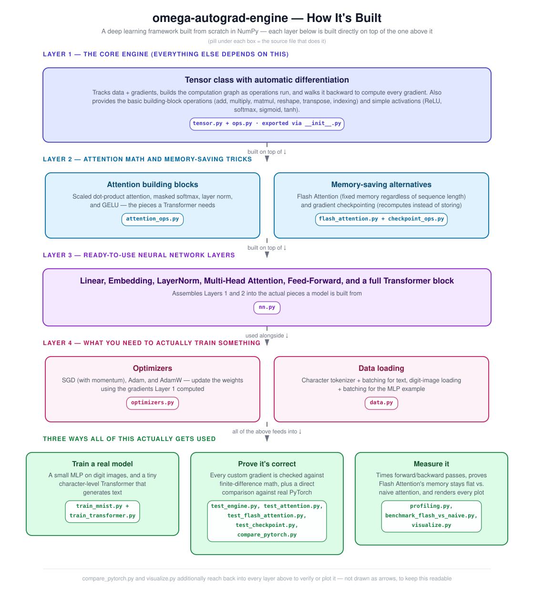

# omega-autograd-engine

A NumPy-based deep learning framework built completely from scratch.

This project starts with a reverse-mode automatic differentiation engine and builds up to a working Transformer. It includes neural network layers, optimizers, attention mechanisms, Flash Attention, gradient checkpointing, and complete training examples.

The goal is to understand how modern deep learning frameworks work internally by implementing the core components instead of relying on PyTorch or TensorFlow.

---

## Architecture



## Features

### Core Engine

- Reverse-mode automatic differentiation
- Dynamic computational graph
- Tensor class with gradient tracking
- Broadcasting support
- Matrix operations
- Automatic backpropagation

### Neural Networks

- Linear layer
- Embedding layer
- Layer Normalization
- ReLU
- GELU
- Softmax
- Sigmoid
- Tanh

### Transformer

- Multi-Head Self Attention
- Causal masking
- Feed Forward Network
- Pre-LayerNorm Transformer Block
- Character-level Language Model

### Optimizers

- SGD
- SGD with Momentum
- Adam
- AdamW

### Memory Optimizations

- Flash Attention
- Gradient Checkpointing

### Testing

- Numerical gradient checking
- PyTorch comparison scripts
- Unit tests for tensor operations
- Unit tests for attention operations
- Flash Attention correctness tests
- Gradient checkpointing tests

---

## Key Components

### Autograd Engine

Implements a Tensor class with reverse-mode automatic differentiation, dynamic computational graphs, broadcasting, and automatic backpropagation.

### Neural Network Layers

Provides the building blocks needed to construct neural networks, including Linear, Embedding, LayerNorm, activation functions, and loss operations.

### Transformer

Implements causal Multi-Head Self Attention, Feed Forward Networks, Pre-LayerNorm Transformer blocks, and a character-level language model.

### Optimizers

Includes SGD, SGD with Momentum, Adam, and AdamW.

### Memory Optimizations

Implements Flash Attention and Gradient Checkpointing to demonstrate techniques used for reducing memory usage during training.

### Testing

Every custom backward implementation is verified using numerical finite-difference gradient checking. Additional comparison scripts are included for validating results against PyTorch.

---

## Running the Project

Install the required packages:

```bash
pip install numpy scipy scikit-learn
```

Run the gradient checks:

```bash
python tests/test_engine.py
python tests/test_attention.py
python tests/test_flash_attention.py
python tests/test_checkpoint.py
```

Train the MLP example:

```bash
python train_mnist.py
```

Train the Transformer language model:

```bash
python train_transformer.py
```

Run the profiling script:

```bash
python profiling.py
```

---

## Verification

This project focuses on correctness as much as implementation.

Custom backward passes are verified using numerical finite-difference gradient checking. The project also includes comparison scripts to validate outputs and gradients against PyTorch where applicable.

The verification covers:

- Core tensor operations
- Matrix multiplication
- Broadcasting
- Layer Normalization
- GELU
- Multi-Head Attention
- Flash Attention
- Gradient Checkpointing

---

## Current Limitations

This project is intended for learning and experimentation rather than large-scale model training.

Current limitations include:

- CPU-only implementation using NumPy
- No GPU acceleration
- No distributed training
- No mixed-precision training
- No dropout
- Small character-level language model
- Uses the scikit-learn Digits dataset instead of the original MNIST dataset

---

## Why This Project?

The objective of this project is to understand how modern deep learning frameworks are built by implementing the core components from scratch.

It covers:

- Automatic differentiation
- Computational graphs
- Neural network layers
- Optimizer implementations
- Transformer architecture
- Attention mechanisms
- Flash Attention
- Gradient Checkpointing
- Numerical gradient verification
- End-to-end model training

---

## Future Improvements

Possible future additions include:

- Positional embeddings
- Additional optimizers
- Model saving and loading
- More Transformer architectures
- Larger datasets
